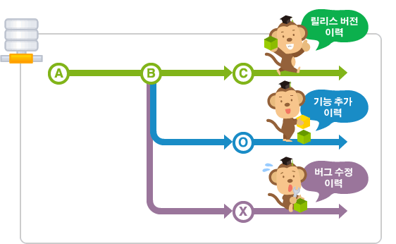
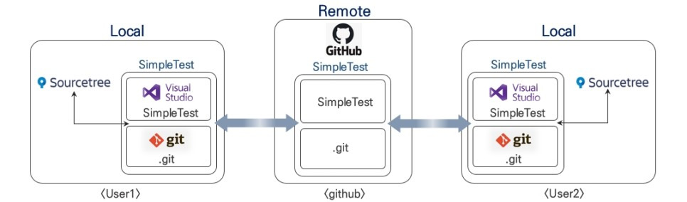

## 깃이란
깃이란 컴퓨터 파일의 변경 사항을 추적하고 파일들의 작업을 조율하는 분산 버전 관리 시스템입니다. 즉, 소프트웨어 개발에서 코드를 관리하고 기록하고 버전 관리를 해주므로 체계적인 개발이 가능하도록 도와주는 무료 공개 소프트웨어입니다.

즉 GIt은 변경 관리 , 브랜치, 머지 등 다양한 기능을 제공합니다. 예를 들어, 개발자가 "커밋"을 통해 코드 변경 사항을 저장하면, 이는 시간을 저장하면, 이는 시간을 거슬러 과거의 상태로 돌아갈수 있는 체크포인트 역할을 합니다. 브랜치 기능을 사용하면,
원본 코드를 변경하지 않고 실험적인 기능을 개발할 수 있는 별도의 작업 공간을 만들 수 있습니다. 이후 '머지'를 통해 성공적인 변화를 메인 프로젝트에 통합할 수 있다.

여기서 __형성관리__ 도구라는 말을 많이 들었을 텐데 이걸 쉽게 풀어 이야기한다면, 개발의 코드를 짜다가 실수를 하거나 오류가 나면 쉽게 최소할수 있고 과거의 원하는 어느 시점으로 돌아갈수있고 과거의 코드와 현재의 코드를 비교해 볼 수 있어서 이러한 __현상을 관리해 주는 도구라고 해서 형상관리 도구__ 라고 한다.

__Git은 항상 만든 파일을 지켜보고 있고 추가 수정 삭제된 사항들을 기록하고 있다. 같은 프로젝트여도 다른 버전으로 생성하여 같은 밑그림에서 작업도 가능하게 해준다 또한  3개의 프로젝트가 완성되는 도착점이 다르더라도 중간에 코드 변경을 일괄적으로 적용할 수 있도록 작업을 도와주는 엄청난 녀석이다.__
위에 말한 장점 중 버전 관리는 특히 굉장히 유용한데요 회사에서 취직하여 일을 하게 된다면 개발을 떠나서 어떠한 문서작업을 하더라도 __버전 관리는 정말 중요하다__  깃에서는 자동으로 버전을 관리를 해 주니 정말 최고의 기능이라고 할 수있습니다.
업데이트와 파일 패치 배포도 아주 쉽게 관리할 수 있다, 그래서 대형 프로젝트를 진행하거나 백엔드와 프론트앤드를 따로 개발할 때도 깃을 자주 사용합니다. 또한 브랜치를 통해 개발한 뒤, 깃에 병합하는 머지로도 진행할수있다.
## 브랜치

 __브랜치란 독립적인 공간을 만든다는 뜻으로 새로 만든 브랜치는 원래 있던 본 작업물과 동일한 상태를 가지며 브랜치에서 수정 후 커밋을 핻 본 작업물에는 어떠한 영향도 미치지 않는다,
똑같은 밑그림을 가지고 복제하여 그곳에 먼저 작업해 볼 수 있다. 또한 분기점을 생성하여 구역을 나눠 동시에 진행이 가능하다는 말 입니다.__ 

__Merge는 병합한다는 의미로써 작업이 성공적으로 진행된 것이 확인됐다면 본 게시물에 병합하는 작업을 Merge라고 합니다. 만약 코드의 오류가 뜨거나 잘못 작업이 되었다면 작업한 브랜치를 지우고 새로 브랜치를 만들어서 다시 작업해 볼수도 있다. 위에 커밋이라는 단어는 변경된 사항들을 확정하여 저장소에 저장한다는 것을 의미한다. 하지만 로컬 저장소를 사용하기 때문에 다른 개발자와 실시간으로 작업을 공유할 수 없다... 여기서 등장한 것이 바로 깃허브이다.__

## 깃허브란 
깃허브는 단순한 원격 저장소를 넘어서 개발자들이 코드를 공유하고 협력할 수 있는 플랫폼입니다. 깃허브의 기능은 __개발자 커뮤니티 구축, 오픈 소스 프레젝트의 호스팅, 이슈 트래킹, 코드리뷰__ 등이 있다. 

깃허브는 클라우드에 잇는 깃 제공자입니다. 깃저장소를 관리하는 클라우드 기반 호스팅 서비스라는 말이다.
내 컴퓨터에서 깃 히스토리를 가져와서 깃허브에 푸시하는 것이다. 그럼 공동 작업자는 이를 가져와서 작업할 수있다.
## 깃과 깃허브의 차이점

깃은 remote 저장소를 지우너한 하는 형상관리 도구이며 깃허브가 바로 깃에서 지원하는 remote 저장소입니다. 깃은 본인의 코드와 수정 내역을 기록하고 관리하는 버전 관리 프로그램으로써 브랜치를 생성하고 복구 삭제 병합하며 작업이 가능합니다. 하지만 로컬 저장소를 사용하기 때문에 다른 사람고 실시간으로 공유가 불가능하지만 깃허브는 공동 작업이 가능하다.